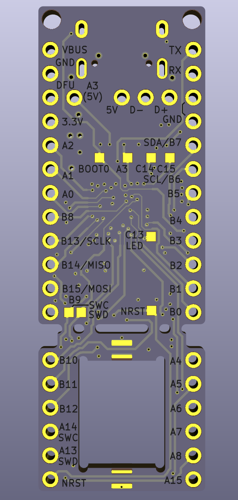

# Bonsai C

Brought to you by customMK, Bonsai C is an open source microcontroller board featuring an STM32F303CC microcontroller. Designed to be a drop-in-replacement for Proton C rev 2, Bonsai C is functionally equivalent to the Proton C, while incorporating several design and manufactring improvements.

 
 
 

## Contents

- [Background](#background)
- [More info](#more-info)
- [Build info](#build-info)
- [License](#license)

## Background

Bonsai C is a general-purpose ARM-based microcontroller board. It was designed to help with the protoype and development of mechanical keyboards, but is versatile enough to be used in a variety of other applications. Mechanical keyboards can use Bonsai C as a "plug in" microcontroller board to their own designs sans-microcontroller, or they can incorporate the Bonsai C schmatic and layout directly into a complete keyboard PCB design.

## Comparison to Proton C

Bonsai C is designed to be a drop-in-replacement to Proton C, and as such, they are functionally equivalent. However, there are several subtle design differences in contrast to Proton C:

Bonsai C uses only parts in the JLCPCB SMT library (including the USB C connector)
Bonsai C’s USB data traces are shorter and more direct
Bonsai C's USB data traces are designed for the correct impedance, using a 4 layer board design with power and ground planes.
Bonsai C’s crystal clock lines are shorter and more direct
Bonsai C adds a ferrite between USB shield and ground, improving EMI (radiated susceptibility and radiated emissions)
Bonsai C connects USB VBUS to the ESD chip instead of the +5V (+5V is polyfuse-limited and reverse-diode-protected)
Bonsai C has correct labeling of the C14 and C15 pads (they are currently swapped in Proton C documentation and PCB silkscreen labeling)
Bonsai C uses ceramic bulk decoupling capacitors instead of tantalum capacitors
Bonsai C avoids via-in-pad (note: via-in-pad without non-conductive epoxy fill can cause solder joints to become starved of solder during assembly)

##Build information

Bonsai C is a four layer PCB design.

If you plan to fabricate the Bonsai C design "as-is" without modificiation, within the "build" folder are three different zip files to make it easier to achieve this:

Bonsai_C_Gerbers_Only.zip contains the Gerber files only. If you plan to solder parts on your own, you can simply take the zip file, send it to the PCB fab of your choice, and get boards made.

Bonsai_C_PCBA.zip has the set of files needed to make fully-assembled PCBs; this includes the Gerber files above as well as a BOM and position file for assembly. These files can be provided to most of PCB assembly shops when ordering fully assembled boards. Depending on the assembly shop, it may be necessary to use alternative parts for some of the passive components (depending on where components are sourced from) but these replacements .

Bonsai_C_JLCPCB_PCBA_20mm_wide.zip is the JLCPCB_PCBA zip file. This differs only from the above file in that the PCB is 2mm wider. For assembly services, JLCPCB requires the PCB to be at least 20mm wide, whereas Bonsai C is designed to be 18mm wide (to match Proton C size). There is no circuitry present in the extra 1mm on each side; it is simply a wider cut to meet JLCPCB assembly requirements. Note that the BOM and position files are already in JLCPCB format, so uploading the design can be done by simply uploading the Gerber zip, BOM file, and CPL file to JLCPCB. However, from time to time, parts may go in and out of stock without suitable replacements in the JLCPCB library, necessitating some tailoring and/or hand soldering of components.

To use the lower cost STM32F303CB microcontroller instead of STM32F303CC, simply edit the BOM file; the footprint is identical between the CC and CB variants.

## License

Open sourced under the [CERN 2.0 permissive license](LICENSE.md).
